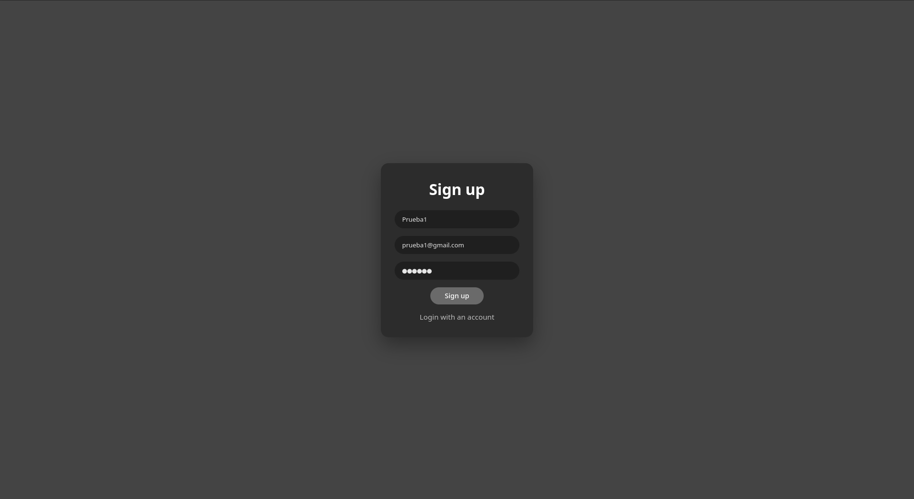
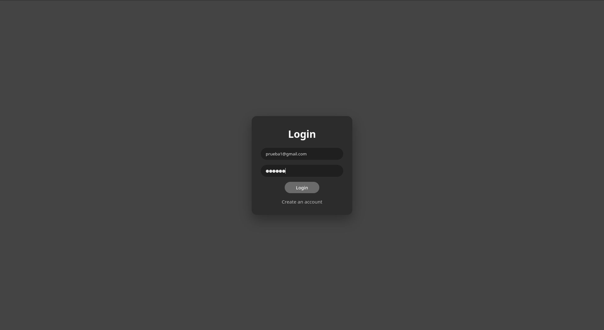
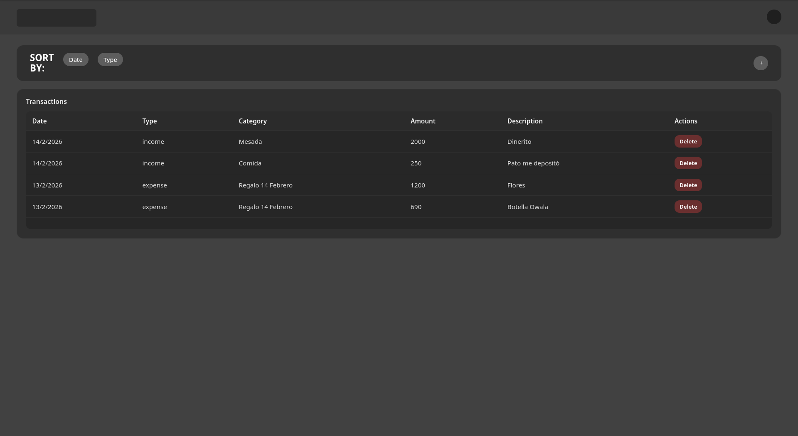
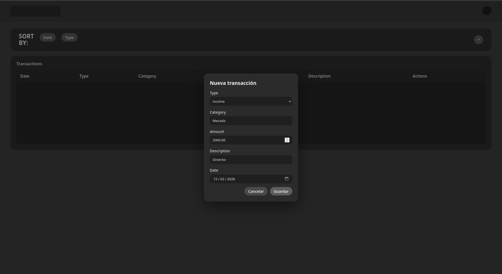
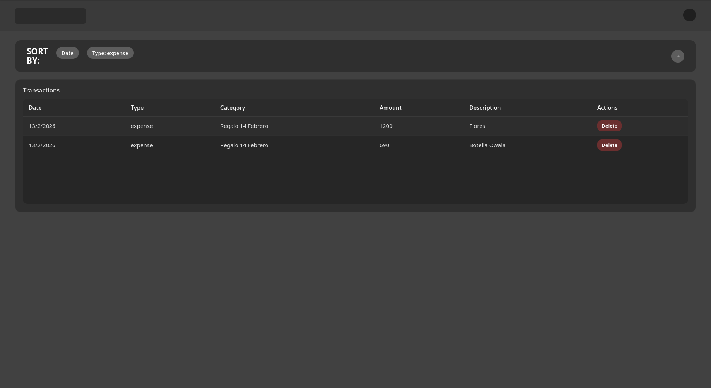
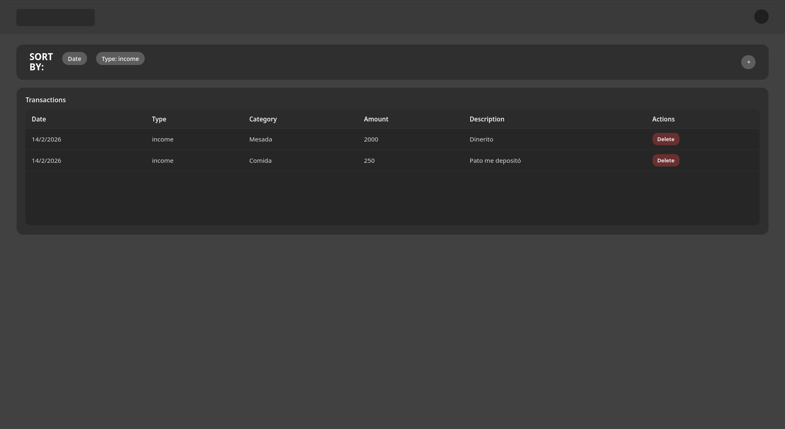
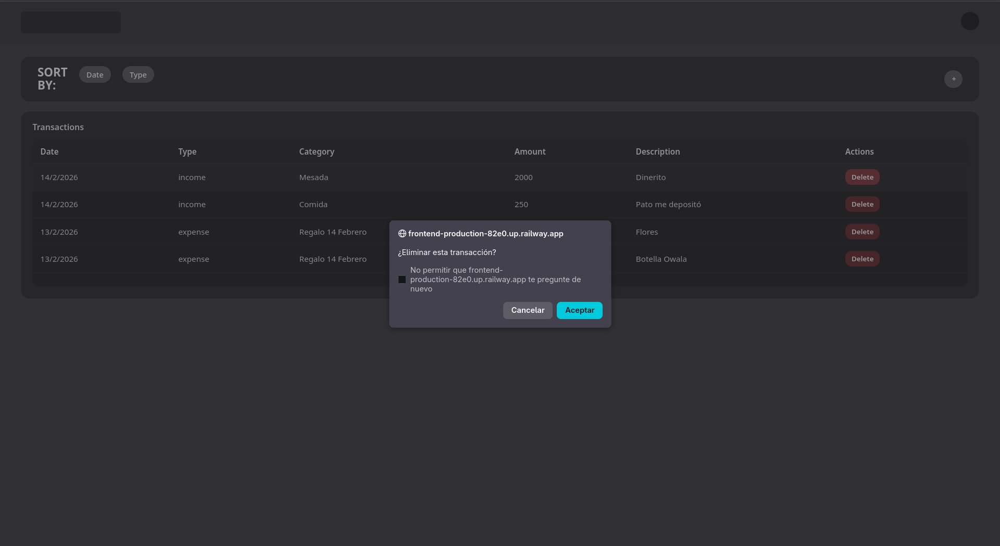
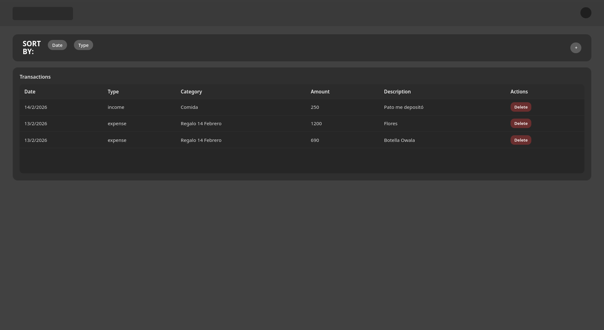
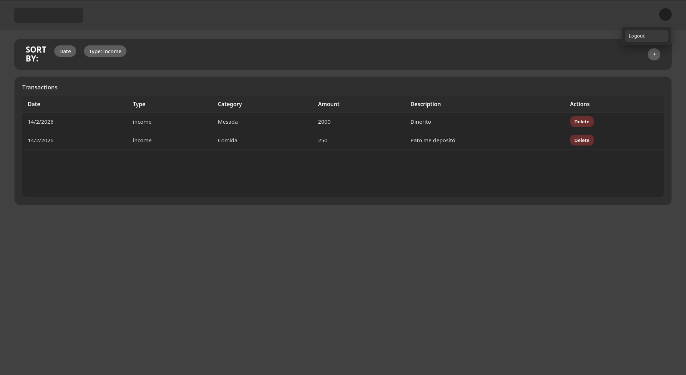

# Actividad 4 - FullStack (Frontend + Backend + MySQL en Railway)

Aplicación web para registrar **transacciones** (ingresos y gastos) con:

- **Autenticación** por JWT (register/login).
- **CRUD básico** de transacciones (POST/GET/DELETE).
- **Base de datos MySQL** alojada en **Railway**.

---

## 1) Estructura del proyecto

Carpetas principales:

- [`Actividad/backend/`](Actividad/backend/) → API en Node.js + Express.
- [`Actividad/frontend/`](Actividad/frontend/) → App en React (Vite).
- [`imgs/`](imgs/) → Capturas para explicar la funcionalidad.

---

## 2) Backend (API)

### 2.1 Tecnologías

- Node.js + Express
- JWT para autenticación
- MySQL (driver `mysql2/promise`)
- CORS habilitado

El servidor se inicia desde [`Actividad/backend/src/server.js`](Actividad/backend/src/server.js:1).

### 2.2 Middlewares

- JSON body parsing: `app.use(express.json())`
- CORS: `app.use(cors())`
- Autenticación: middleware [`auth()`](Actividad/backend/src/middlewares/auth.js:5)

El middleware [`auth()`](Actividad/backend/src/middlewares/auth.js:5) valida que exista el header:

```txt
Authorization: Bearer <TOKEN>
```

Luego verifica el token con `jwt.verify(...)` y asigna el payload decodificado a `req.user`.

### 2.3 Rutas

Rutas montadas en [`server.js`](Actividad/backend/src/server.js:27):

- `GET /` → Health check.
- `POST /api/auth/register` → Registro.
- `POST /api/auth/login` → Login.
- `/api/transactions` → Rutas protegidas para transacciones.

#### Auth

Definidas en [`Actividad/backend/src/routes/auth.routes.js`](Actividad/backend/src/routes/auth.routes.js:1):

**POST** `[/api/auth/register](Actividad/backend/src/routes/auth.routes.js:17)`

- Body:

```json
{
  "name": "Tu nombre",
  "email": "correo@dominio.com",
  "password": "tuPassword"
}
```

- Inserta el usuario en tabla `users`.
- La contraseña se guarda hasheada con `bcrypt.hash(...)`.
- Si el correo ya existe devuelve `409 (ER_DUP_ENTRY)`.

**POST** `[/api/auth/login](Actividad/backend/src/routes/auth.routes.js:36)`

- Body:

```json
{
  "username": "correo@dominio.com",
  "password": "tuPassword"
}
```

- Busca al usuario por email.
- Valida password con `bcrypt.compare(...)`.
- Devuelve un `token` JWT con expiración de 1 hora.

#### Transacciones

Definidas en [`Actividad/backend/src/routes/transaction.routes.js`](Actividad/backend/src/routes/transaction.routes.js:1) (todas requieren [`auth()`](Actividad/backend/src/middlewares/auth.js:5)):

- **POST** `/api/transactions` → Crear transacción.
- **GET** `/api/transactions` → Listar transacciones del usuario.
- **DELETE** `/api/transactions/:id` → Eliminar transacción por id (solo si pertenece al usuario).

La lógica está en el controlador [`transactions.controller.js`](Actividad/backend/src/controllers/transactions.controller.js:7) y el modelo [`transaction.model.js`](Actividad/backend/src/models/transaction.model.js:1).

**Campos esperados al crear transacción** (ver [`createTransactionController`](Actividad/backend/src/controllers/transactions.controller.js:7)):

```json
{
  "type": "income" | "expense",
  "category": "string",
  "amount": 123.45,
  "description": "string",
  "date": "YYYY-MM-DD"
}
```

---

## 3) Base de Datos (MySQL en Railway)

La conexión se realiza con un pool de MySQL configurado en [`Actividad/backend/src/config/db.js`](Actividad/backend/src/config/db.js:1).

Características importantes:

- Usa variables de entorno `DB_HOST`, `DB_PORT`, `DB_USER`, `DB_PASS`, `DB_NAME`.
- Se conecta por SSL (`ssl: { rejectUnauthorized: false }`) para compatibilidad con Railway.

### 3.1 Tablas utilizadas (según consultas del código)

**users** (ver query en [`auth.routes.js`](Actividad/backend/src/routes/auth.routes.js:22)):

- `id` (PK)
- `name`
- `email` (UNIQUE)
- `password` (hash)

**transactions** (ver queries en [`transaction.model.js`](Actividad/backend/src/models/transaction.model.js:6)):

- `id` (PK)
- `user_id` (FK a `users.id`)
- `type` (`income` | `expense`)
- `category`
- `amount`
- `description`
- `date`

> Nota: el backend siempre filtra por `user_id` para que cada usuario solo vea y elimine sus propias transacciones (ver [`getTransactionsByUserId`](Actividad/backend/src/models/transaction.model.js:15) y [`deleteTransaction`](Actividad/backend/src/models/transaction.model.js:23)).

---

## 4) Frontend (React + Vite)

### 4.1 Tecnologías

- React
- React Router
- Vite

Rutas de la app (ver [`App()`](Actividad/frontend/src/App.jsx:7)):

- `/login` → Login
- `/register` → Registro
- `/dashboard` → Panel de transacciones

### 4.2 Consumo del API

El frontend construye la URL del backend con [`buildApiUrl()`](Actividad/frontend/src/lib/api.js:13), usando la variable:

- `VITE_API_URL` (por defecto cae a `http://localhost:3000` si no se define)

En el dashboard:

- **GET** transacciones: ver [`fetchTransactions()`](Actividad/frontend/src/pages/DashboardView.jsx:37)
- **POST** transacción: ver [`handleCreate()`](Actividad/frontend/src/pages/DashboardView.jsx:97)
- **DELETE** transacción: ver [`handleDelete()`](Actividad/frontend/src/pages/DashboardView.jsx:66)

El token JWT se guarda en `localStorage` al hacer login (ver [`Login`](Actividad/frontend/src/pages/Login.jsx:60)) y se envía como `Authorization: Bearer <token>`.

---

## 5) Variables de entorno

### Backend

El backend espera (ver [`db.js`](Actividad/backend/src/config/db.js:6) y [`auth.routes.js`](Actividad/backend/src/routes/auth.routes.js:14)):

- `DB_HOST`
- `DB_PORT`
- `DB_USER`
- `DB_PASS`
- `DB_NAME`
- `JWT_SECRET`

**Importante:** no publiques credenciales reales en el README.

### Frontend

El frontend usa:

- `VITE_API_URL` → URL del backend (Railway o localhost).

---

## 6) Ejecución local

### 6.1 Backend

Desde [`Actividad/backend/package.json`](Actividad/backend/package.json:1):

```bash
cd Actividad/backend
npm install
npm run dev
```

Por defecto el backend corre en `http://localhost:3000` (ver [`server.js`](Actividad/backend/src/server.js:12)).

### 6.2 Frontend

Desde [`Actividad/frontend/package.json`](Actividad/frontend/package.json:1):

```bash
cd Actividad/frontend
npm install
npm run dev
```

---

## 7) Pruebas de API (POST / GET / DELETE)

Puedes probar con **Postman**, **Insomnia** o con **curl**.

En los ejemplos usa:

- `BASE_URL=http://localhost:3000` (local)
- o la URL desplegada en Railway (ej: `https://<tu-backend>.up.railway.app`)

### 7.1 Register (POST)

Endpoint: `POST /api/auth/register` (ver [`/register`](Actividad/backend/src/routes/auth.routes.js:17))

```bash
curl -X POST "$BASE_URL/api/auth/register" \
  -H "Content-Type: application/json" \
  -d '{"name":"Juan","email":"juan@mail.com","password":"123456"}'
```

### 7.2 Login (POST) → Token

Endpoint: `POST /api/auth/login` (ver [`/login`](Actividad/backend/src/routes/auth.routes.js:36))

```bash
curl -X POST "$BASE_URL/api/auth/login" \
  -H "Content-Type: application/json" \
  -d '{"username":"juan@mail.com","password":"123456"}'
```

Respuesta esperada (ejemplo):

```json
{ "message": "Login correcto", "token": "..." }
```

Guarda el token en una variable de shell:

```bash
TOKEN="<pega-tu-token-aqui>"
```

### 7.3 Crear transacción (POST)

Endpoint: `POST /api/transactions` (ver [`router.post("/")`](Actividad/backend/src/routes/transaction.routes.js:12))

```bash
curl -X POST "$BASE_URL/api/transactions" \
  -H "Content-Type: application/json" \
  -H "Authorization: Bearer $TOKEN" \
  -d '{
    "type":"income",
    "category":"salary",
    "amount":1500.50,
    "description":"Pago mensual",
    "date":"2026-02-15"
  }'
```

### 7.4 Obtener transacciones (GET)

Endpoint: `GET /api/transactions` (ver [`router.get("/")`](Actividad/backend/src/routes/transaction.routes.js:13))

```bash
curl -X GET "$BASE_URL/api/transactions" \
  -H "Authorization: Bearer $TOKEN"
```

Devuelve un arreglo de transacciones del usuario autenticado (ver [`getTransactionsByUserId`](Actividad/backend/src/models/transaction.model.js:15)).

### 7.5 Eliminar transacción (DELETE)

Endpoint: `DELETE /api/transactions/:id` (ver [`router.delete("/:id")`](Actividad/backend/src/routes/transaction.routes.js:14))

```bash
TX_ID=1
curl -X DELETE "$BASE_URL/api/transactions/$TX_ID" \
  -H "Authorization: Bearer $TOKEN"
```

Si la transacción no existe o no pertenece al usuario, responde `404` (ver [`deleteTransactionController`](Actividad/backend/src/controllers/transactions.controller.js:39)).

---

## 8) Evidencias / Imágenes de la funcionalidad

Las imágenes están en la carpeta [`imgs/`](imgs/). A continuación se incluyen para explicar el flujo principal:

### 8.1 Registro



### 8.2 Login



### 8.3 Dashboard

Vista principal del dashboard:


Dashboard con transacciones cargadas:



### 8.4 Agregar transacción

Formulario/modal para agregar una transacción:



### 8.5 Ordenar/Filtrar por tipo

Filtrado por gastos (`expense`):



Filtrado por ingresos (`income`):



### 8.6 Eliminar transacción

Botón de eliminar y confirmación:



Transacción eliminada:



### 8.7 Logout

Salida de sesión:


